# Task 4.2 Report
## Task 1
Simulate the corporate network of the organization, which contains 2 houses of 2 floors in each. 

Horizontal floor subsystem consists of one working group of 5 computers. 

Analyze network performance and traffic.

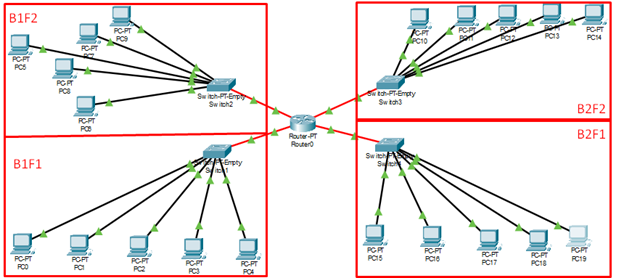

B - building; F - floor

Router settings

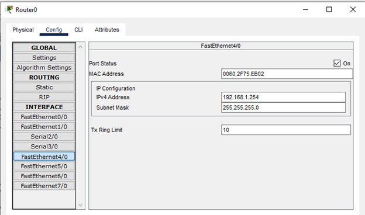

Gateways assigned:
* Network 1 - 192.168.1.254
* Network 2 - 192.168.2.254
* Network 3 - 192.168.3.254
* Network 4 - 192.168.4.254

PC settings

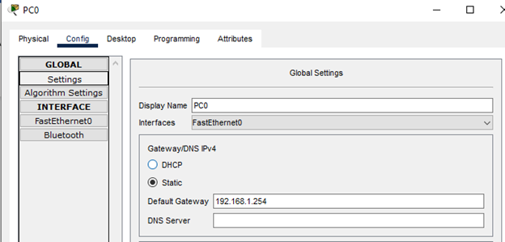

IP - adresses assigned:
* Network 1 - 192.168.1.1-5
* Network 2 - 192.168.2.1-5
* Network 3 - 192.168.3.1-5
* Network 4 - 192.168.4.1-5

I used ping to make sure that's my network works

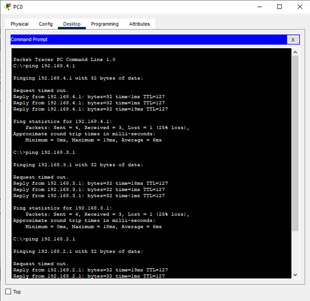
## Task 2
Simulate the corporate network that contains one
house with four floors. 
The horizontal subsystem of the floor consists of two working groups on 3 and 5 computers accordingly. 
Divide the network on eight subnets,analyze network performance and traffic.

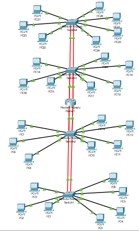

IP - adresses assigned:
* Network 1 - 192.168.1.1-3
* Network 2 - 192.168.2.1-4
* Network 3 - 192.168.3.1-3
* Network 4 - 192.168.4.1-4
* Network 5 - 192.168.5.1-3
* Network 6 - 192.168.6.1-4
* Network 7 - 192.168.7.1-3
* Network 8 - 192.168.8.1-4

Gateways assigned:
* Network 1 - 192.168.1.254
* Network 2 - 192.168.2.254
* Network 3 - 192.168.3.254
* Network 4 - 192.168.4.254
* Network 5 - 192.168.5.254
* Network 6 - 192.168.6.254
* Network 7 - 192.168.7.254
* Network 8 - 192.168.8.254

Switch physical setup

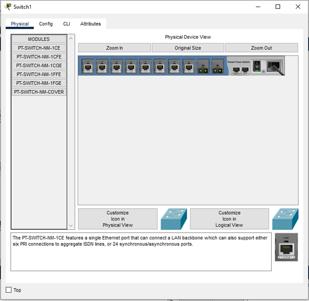

Router physical setup

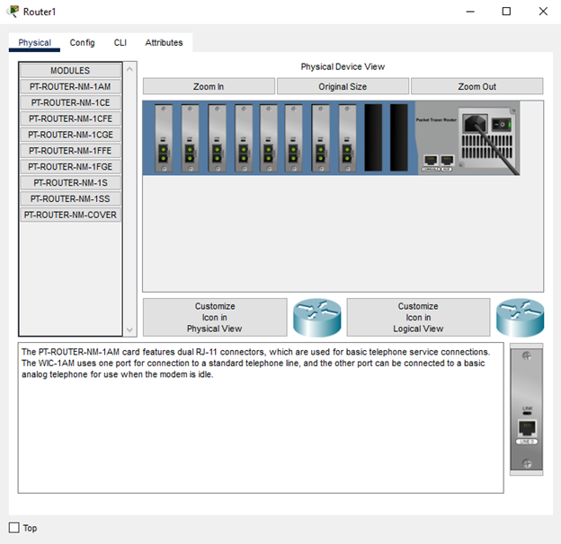

Network traffic possibilities

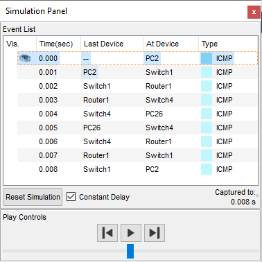

All PC's can communicate with each other
## Task 3
Simulate the local network of 5 buildings with 1 floor.
One building - 1 working group of 6 computers. 
The network is being built based on a router with one WAN port.

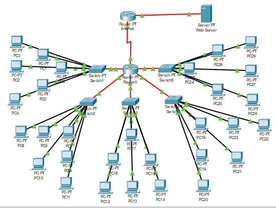

Static routing on Router0

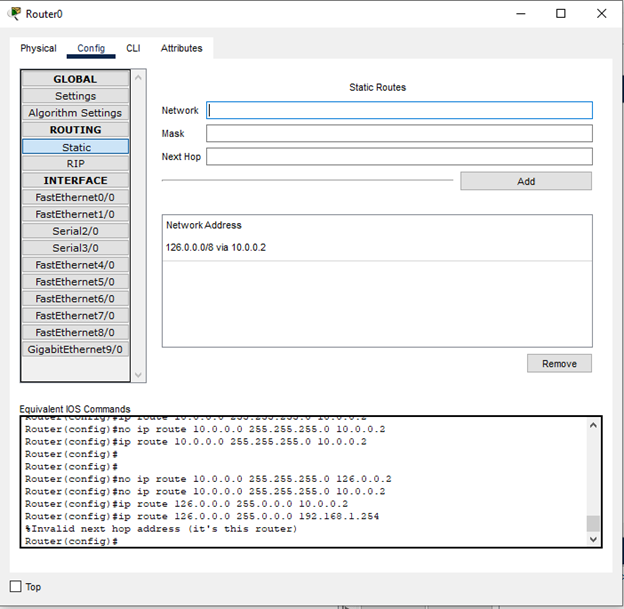

Static routing on Internet router

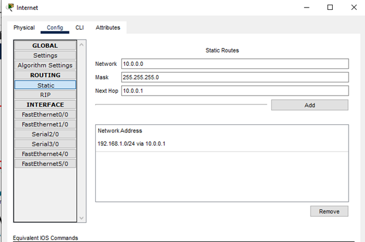

Routers connected via Serial cable with IP’s:
10.0.0.1 for Router0
10.0.0.2 for Internet Router

Network setup (IP and gateway assignment) is similar to previous tasks

Web-Server has 126.0.0.1 IP-address and 126.0.0.2 gateway on router

Applied static routing allows all PC's communicate with each other, but only 1st network can access to web-server

Let's see if it works

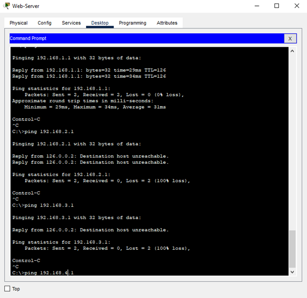

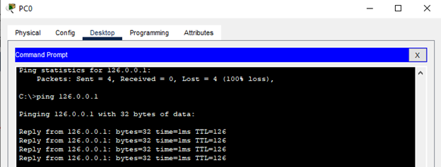

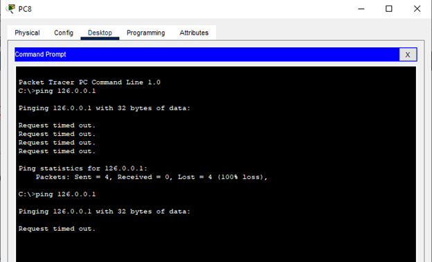

