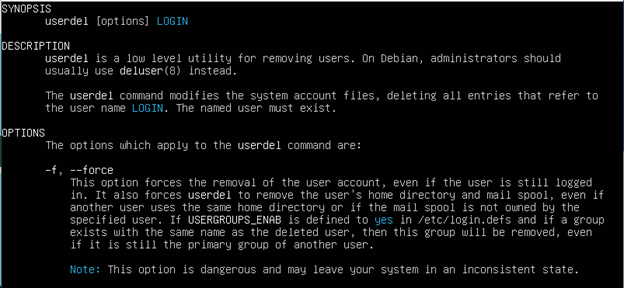
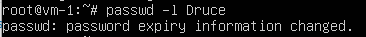
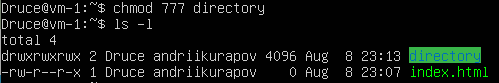

# Task 5.2 Report
## 1 Analyze the structure of the /etc/passwd and /etc/group file
 

* andriikurapov: username;
* x: place for password information; the password can be found in the / etc / shadow file.
* 1000: User ID. Each user has a unique identifier, thanks to which the system recognizes him. 
  The root user ID is always 0;
* 1000: group ID. Each group has a unique identifier. By default, each user has a main group. 
  Again, the root group ID is always 0;
* Andrii: field for notes. This field can be used to describe the user or his functions. It can contain anything from the user's contact information to a description of the services for which the account was created;
* /home/andriikurapov: home directory. For normal users, the home directory is / home / username; for the root user, it is / root;
* / bin / bash: user's shell. This field contains the shell that will be created or the commands that will be executed when the user logs on

/ etc / group is an ASCII file that describes the groups that users are members of. Each line of the file contains one entry in the following format: group_name: password: GID: user_list

Here are descriptions of these fields:

* group_name - name of a specific group

* password (encrypted) group password. If this field is blank, then no password needed

* GID is the numeric identifier (ID) of the group

* user_list - comma separated names of all users who are members of this groups

## 2 What are the uid ranges? What is UID? How to define it?
UID - unique identifier of a user in the system. 
The system tracking users by UID, not by name.
The root user has an UID of 0. System users have UIDs from 1 to 100. 
Regular users have a UID equal 100 and further.
I can define it using `id -u` utility or open up /etc/passwd file

## 3 What is GID? How to define it?
GID - defines the user’s group that he belongs to. Each user can belong to one or more groups. 
The system administrator establishes a user's group membership in order to be able to restrict user access to certain system resources.

We can define GID by using `id -g` or `groups`

Also we can open /etc/groups file
## 5 What are the commands for adding a user to the system? What are the basic parameters required to create a user?
`Useradd -m -d /home/druce -s  /bin/bash druce -p lSb352`

`sudo adduser`

## 6 How do I change the name (account name) of an existing user?
We can use `usermod -l`

## 7 What is skell_dir? What is its structure?
Skell directory is used to initiate home directory when a user is first created. A sample layout of “skeleton” user files is as shown below:

## 8 How to remove a user from the system (including his mailbox)?
We can use `deluser -r`

Or `userdel -f`

## 9 What commands and keys should be used to lock and unlock a user account?

We can also use `usermod -l (username)` to lock and `usermod -U (username)` to unlock users
## 10 How to remove a user's password and provide him with a password-free login for subsequent password change? 

## 11 Display the extended format of information about the directory, tell about the information columns displayed on the terminal.

1. first letter defines file type (‘d’ – directory, ‘-‘ - usual file)
2. rwxrwxrwx – access permissions (user, group, other)
3. number of hard links
4. owner username
5. owner group
6. File size in bytes
7. Date
8. File name

## 12 What access rights exist and for whom (i. e., describe the main roles)? Briefly describe the acronym for access rights.
Main roles: 
* User – Defines file owner permissions
* Group – Defines permissions for owner’s main group
* Other – Defines permissions for all other users in the system

1. R – Read (Allows reading)
2. W – Write (Allows file editing)
3. X – Execute (Allows file execution)

For directories, r w x flags have a slightly different meaning: 
* r - allows you to read only the file names in the directory; 
* x - allows you to have access to the files themselves and their attributes (but not names); 
* w only makes sense in conjunction with x, and allows (in addition to x) manipulation of files in a directory (create, delete, and rename). w without x is useless.

## 13 What is the sequence of defining the relationship between the file and the user?
We can use `ls -l` command to see file permissions 

* --- - no rights, at all;
* --x - only execution of the file is allowed as a program, but not modification or reading;
* -w- - only writing and modifying the file is allowed;
* -wx - modification and execution are allowed, but in the case of a directory, you cannot see its contents;
* r-- - read-only permission;
* r-x - read only and execute, no write permission;
* rw- - read and write permissions, but no execution;
* rwx - all permissions;
* --s - the SUID or SGID bit is set, the first is displayed in the field for the owner, the second for the group;
* --t - sticky-bit is set, which means users cannot delete this file.
## 14 What commands are used to change the owner of a file (directory), as well as the mode of access to the file?

## 15 What is an example of octal representation of access rights? Describe the umask command.
Each access level has an octal value

When a file or directory is created, the operating system environment assigns them certain default permissions, 
and the umask is a user mask that is used to determine the ultimate permissions.

How to calculate (determine) file permissions for mask 022 (root user):
Default rights: 666

Subtracted umask value: 022 (-)

Total rights: 644
## 16 Give definitions of sticky bits and mechanism of identifier substitution. Give an example of files and directories with these attributes.
The Unix access rights flags setuid and setgid (short for "set user ID" and "set group ID") 
allow users to run an executable with the file system permissions of the executable's owner or group respectively and to change behaviour in directories. 
They are often used to allow users on a computer system to run programs with temporarily elevated privileges in order to perform a specific task. 
While the assumed user id or group id privileges provided are not always elevated, at a minimum they are specific.

The flags setuid and setgid are needed for tasks that require different privileges than what the user is normally granted, 
such as the ability to alter system files or databases to change their login password. 
Some of the tasks that require additional privileges may not immediately be obvious, though, such as the ping command, which must send and listen for control 
packets on a network interface.

SUID example
 

GUID example

When a directory's sticky bit is set, the filesystem treats the files in such directories in a special way so only the file's owner, the directory's owner, or root user can rename or delete the file. 
Without the sticky bit set, any user with write and execute permissions for the directory can rename or delete contained files, regardless of the file's owner. 
Typically this is set on the /tmp directory to prevent ordinary users from deleting or moving other users' files. 

Sticky bit example 

## 17 What file attributes should be present in the command script?

Script must have execution permission at least for user to work properly!
