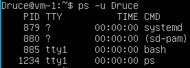
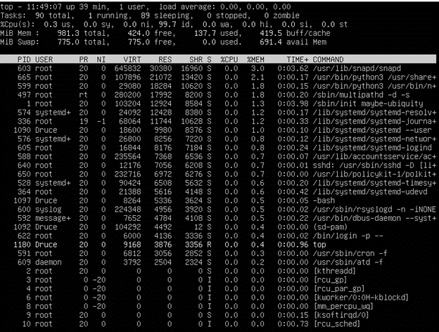
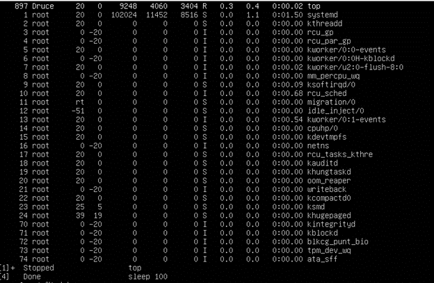
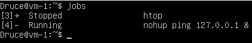

# Task 5.3 Report 
## Part 1
### 1 How many states could has a process in Linux?
Linux has basically 5 states: 
1. Running/Runnable (R): running processes are processes using a CPU core right now, a runnable process is a process that has everything to run  and is just waiting for a CPU core slot. 
2. Sleeping: a sleeping process is a process waiting for a resource to be available (for example, a I/O operation to complete) or an event to happen (like a certain amount of time to pass).
   The difference between process in Interruptible Sleep (S) state and Uninterruptible Sleep (D) is that the former will wake up to handle signals while the former won't. Let's suppose that a process is waiting for a I/O operation to complete before wake up. 
   If in the meantime, it receives a signal to terminate (SIGKILL), it will terminate before having the chance to handle the requested data. That's why I/O operations normally go to uninterruptible sleep while waiting for the result: 
   they will wake up with when the operation is ready, handle the result and, only then, check for any pending signal to handle. Processes that can be terminated before the wake up condition is fulfilled without any consequence usually go to interruptible sleep instead.
3. Stopped (T): a process becomes stopped when it receives the SIGSTOP signal (not unlike when you press <ctrl>+z in the shell, although <ctrl>+z sends a SIGTSTP instead). 
   When stopped, the process execution is suspended and the only signals it will handle are SIGKILL and SIGCONT. The former will remove the process permanently, while the later will put the process back to the Running/Runnable state 
   (like when you run fg or bg after pressing <ctrl>+z in the shell).
4. Zombie (Z): When a process finishes with exit() system call, its state needs to be "reaped" by its parent (calling wait()); in the meantime, the child process remains in zombie state (not alive nor dead).
### 2 Examine the pstree command. Make output (highlight) the chain (ancestors) of the current process.
I used `pstree -h` command


### 3 What is a proc file system?
he proc filesystem (procfs) is a special filesystem in Unix-like operating systems that presents information about processes and other system information in a hierarchical file-like structure, providing a more convenient and standardized method for dynamically accessing process data held in the kernel than traditional tracing methods or direct access to kernel memory. 
Typically, it is mapped to a mount point named /proc at boot time. The proc file system acts as an interface to internal data structures about running processes in the kernel. In Linux, it can also be used to obtain information about the kernel and to change certain kernel parameters at runtime (sysctl).
### 4 Print information about the processor
I used `lscpu` command:


### 5 . Use the ps command to get information about the process. The information should be as follows: the owner of the process, the arguments with which the process was launched for execution, the group owner of this process, etc
I used command Command `ps -o [pcpu, pmem, args, comm, cputime, pid, gid, lwp, rss, start, user, vsize, priority]`


### 6 How to define kernel processes and user processes?
User-space processes have its own virtual address space.

Kernel processes or threads do not have their own address space, they operate within kernel address space only. 
And they may be started before the kernel has started any user process (e.g. init).

### 7 Print the list of processes to the terminal. Briefly describe the statuses of the processes


R+ means that process is running in the foreground process group
S – process currently sleeping (pending less then 20 sec.)

What condition are they in, or can they be arriving in?
* D - uninterruptible sleep (usually IO)
* R - running or runnable (on run queue)
* S - interruptible sleep (waiting for an event to complete)
* T - stopped by job control signal
* t - stopped by debugger during the tracing
* W - paging (not valid since the 2.6.xx kernel)
* X - dead (should never be seen)
* Z - defunct ("zombie") process, terminated but not reaped by its parent
### 8 Display only the processes of a specific user
I used `ps -u Druce`


### 9 What utilities can be used to analyze existing running tasks (by analyzing the help for the ps command)?
We can use top or htop utilities


### 10 What information does top command display?


* PID - process identifier
* USER - the user from whom the process was started
* PR – process priority
* NI - the priority given by the nice command. -20 (highest) to 19
* VIRT - total amount of virtual memory that the process is using
* RES - current RAM usage
* SHR - The amount of shared memory used by a task.  It simply reflect memory that could be potentially shared with other processes
* S (STATE) - the current state of the process ("START", "RUN" (only in this state it shows the current load of the program on the processor), "SLEEP", "STOP", "ZOMB", "WAIT" or "LOCK")
* % CPU - percentage of available CPU time that the running program was using
* % MEM - percentage of RAM used by this process
* TIME+ - CPU usage time in seconds
* COMMAND - the command that started the process

### 11 Display the processes of the specific user using the top command
I used command `top -u Druce` 


### 12 What interactive commands can be used to control the top command? Give a couple of examples.
* [1] Display all statistics for all CPU cores
* [c] The absolute path of the command module location and its arguments


* [h] Display help about the program


* [k] Kill the process. The program asks you for a process code and a signal that will be sent to it.
* [M] Sort by the amount of used memory.



* [n] Change the number of displayed processes. You are prompted to enter a number.
* [P] Sort by CPU load.
* [r] Change the priority of the process.
* [u] Sort by username.
* [Z] Select highlight color.
* [z] Highlight running processes.
* [Space] Immediately refresh the contents of the screen.

### 13 Sort the contents of the processes window using various parameters (for example, the amount of processor time taken up, etc.)
We can use `top -O` to see all available fields for sorting


`top -o TIME`


`top -o PID`


### 14 Concept of priority, what commands are used to set priority?
We can set priority for a command using `nice` command
`nice -n 15 top -o PR`


If we want to change priority of already running process, we can use renice
`renice 5 -p 1097`


### 15 Can I change the priority of a process using the top command? If so, how?
We can press "r" button in top utility. It allows us to change priority of the process via PID


### 16 Examine the kill command. How to send with the kill command process control signal? Give an example of commonly used signals.
`kill` is a command that is used in several popular operating systems to send signals to running processes.

SIGTERM (15) - This signal requests the process to stop running. It can be ignored. 
The process is given time to complete correctly. 
If the program terminates correctly, then it used this time to save its state or work 
results and free up resources. 
In other words, it isn't forced to stop.

SIGKILL (9) - This signal causes the process to terminate immediately. The program cannot ignore this signal. Unsaved results will be lost.

We can use `man 7 signals` to find out more about signals


### 17 Commands jobs, fg, bg, nohup. What are they for?
`Jobs` allows us to see processes that was stopped or running in the background


If we use `fg 1` command, top interface will appear on the screen




The bg command is intended to resume execution of a stopped task in the background in the bash and ksh shells


`nohup` command allows you to start processes that will be disconnected from the terminal if the terminal is closed.
`nohup ping 127.0.0.1 &`




As we can see, PPID of ping equals to bash PID 
## Part 2
### 1 Check the implementability of the most frequently used OPENSSH commands in the MS Windows operating system


`ssh`


`ssh-keygen`


Keys generated succesfully!

`ssh-copy-id` allows us to easily deploy public key on ssh server
Example: `ssh-copy-id username@localhost`
Unfortunately, on Windows we can only copy public key to server using `scp`


### 2 Implement basic SSH settings to increase the security of the client-server connection 
1. Disabled root login in sshd_config file ( PermitRootLogin no )
2. Implied ssh key authentication


3. Configured Idle Timeout Interval
   ```
   ClientAliveInterval 200
   ClientAliveCountMax 0
   ```
### 3 List the options for choosing keys for encryption in SSH. Implement 3 of them
ssh-keygen supports 4 key types:
- RSA


- DSA


- ECDSA

 

- ed25519
### 4 Implement port forwarding for the SSH client from the host machine to the guest Linux virtual machine behind NAT. 


