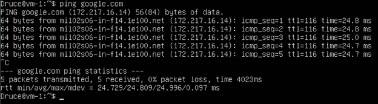

# Task 6.1 Report
## 1 Create virtual machine connection according to task
### VM-1 Setup
Netplan
`sudo nano /etc/netplan/00-installer-config.yaml`


`sudo netplan apply`

Ifconfig


I implied default ufw rules:
```
sudo ufw default deny incoming
sudo ufw default allow outgoing
sudo ufw enable
```
### VM-2 Setup
Netplan


ifconfig


I implied default ufw rules:
```
sudo ufw default deny incoming
sudo ufw default allow outgoing
sudo ufw enable
```
Let's ping VM-1 from VM-2


### NAT (MASQUERADE) setup on VM-1
Enable ip-forwarding - `sudo echo 1 > /proc/sys/net/ipv4/ip_forward`
Apply ufw forwarding policy - `sudo ufw default allow forward`
Apply nat table rules and traffic forwarding via NAT interface using /etc/ufw/before.rules file


After applying this settings we need to reload firewall - `sudo ufw reload`

Let's try to ping our host machine


 
## 2 Check the route from VM2 to host

## 3 Check the access to the Internet, (just ping, for example, 8.8.8.8)

## 4 Determine, which resource has an IP address 8.8.8.8

## 5 Determine, which IP address belongs to resource epam.com

## 6 Determine the default gateway for your HOST and display routing table

## 7 Trace the route to google.com

