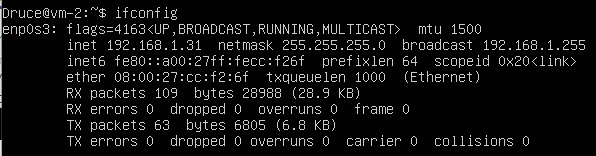
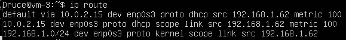

# Task 6.2 Report
## DHCP setup using DNSMASQ
I use ubuntu server 18.08, which contains system-resolv service 
System-resolv conflicts with dnsmasq because they both using 53 tcp-port
I used following commands:
```
sudo systemctl disable systemd-resolved
sudo systemctl stop systemd-resolved
```
I installed dnsmasq 
`sudo apt-get install dnsmasq`
And opened dnsmasq config to enable dhcp service
`Sudo nano /etc/dnsmasq.conf`
I applied next settings


I’ve enabled dhcp-service on vm-2 and vm-3 via netplan


After that, I restarted dnsmasq service
`sudo systemctl netplan`
Let’s see which addresses was assigned to our vm’s




ISC-DHCP
`Sudo service dnsmasq stop`


I installed isc-dhcp via apt
`sudo apt-get install isc-dhcp-server`

We need to add interface into isc-dhcp-server config
`sudo nano /etc/default/isc-dhcp-server`


I came up with the following dhcpd.conf setup


Let’s restart isc-dhcp, vm-2 and vm-3 network devices and check the status
`sudo service isc-dhcp-server restart`
`sudo ifdown -a ; ifup -a`


Pings from VM-3


Pings from VM-2


## DNSMASQ DNS
Enable dnsmasq service
`Sudo systemctl enable dnsmasq`

Add our dns server in the netplan


Edit file /etc/hosts


Add nameserver to vm-2 and vm-3 netplans and try to ping out vm’s by the name


## OSPF dynamic routing
Install quagga
`sudo apt-get install quagga`
I copied config examples to /etc/quagga directory
```
cp /usr/share/doc/quagga-core/examples/vtysh.conf.sample /etc/quagga/vtysh.conf
cp /usr/share/doc/quagga-core/examples/zebra.conf.sample /etc/quagga/zebra.conf
cp /usr/share/doc/quagga-core/examples/bgpd.conf.sample /etc/quagga/bgpd.conf
sudo chown quagga:quagga /etc/quagga/*.conf
sudo chown quagga:quaggavty /etc/quagga/vtysh.conf
sudo chmod 640 /etc/quagga/*.conf
```
Created directory for logs and log files
```
mkdir /var/log/quagga/
chown quagga:quagga /var/log/quagga/
touch /var/log/zebra.log
chown quagga:quagga/var/log/zebra.log
```
I’ve started zebra and ospfd 
```
sudo service zebra start
sudo service zebra status
sudo service ospfd start
sudo service ospfd status
```
I’ve came up with following ospfd.conf settings


To check ospfd.conf state we can use `ospfd` command
After that, we can restart ospfd service and networking devices on VM-2 and VM-3
`sudo service ospfd restart`
`sudo service networking restart`

VM-1 routing


VM-2 routing


VM-3 routing



VM-3 Traceroute


VM-3 Netplan 

