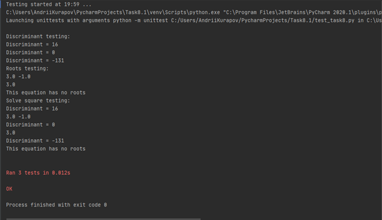

# Task 8.1 Report
Create script which can solve quadratic equations (ax^2 + bx + c = 0)

## main() function:
```
def main():
    inpt = input("a = ")
    a = validate_param(inpt)

    inpt = input("b = ")
    b = validate_param(inpt)

    inpt = input("c = ")
    c = validate_param(inpt)

    roots = solve_square(a, b, c)
    square_print(a, b, c, roots)
```
Main() function validates input  from `inpt` variable and writes validated result in variables “a, b, c”
Writes result of `solve_square` function into `roots` variable and prints equation solution via `square_print(a, b, c, roots)` function

## Parameter validation function:
```
def validate_param(inpt):
    i = 0
    while i < 2:
        try:
            return int(inpt)
        except ValueError:
            inpt = input("Try integer: ")
            i += 1
    exit(1)
```
This function has variable `i` used as counter for `while` loop. Function attempts to return int value of `inpt` variable.
In case if `inpt` variable isn’t integer, our function excepts Value error, asks us to rewrite `inpt` variable and increase `i` value by 1 for each exception. When `I = 2`, function exits with exitcode 1

## Discriminant function:
```
def discriminant(a, b, c):
    d = b ** 2 - 4 * a * c
    print("Discriminant = %i" % d)
    return d
```
Saving and returning results of discriminant formula in variable `d`

## Roots function:
```
def roots(d, a, b, c):
    if d > 0:
        x1 = (-b + math.sqrt(d)) / (2 * a)
        x2 = (-b - math.sqrt(d)) / (2 * a)
        print(x1, x2)
        return x1, x2
    elif d == 0:
        x1 = -b / (2 * a)
        print(x1)
        return x1
    else:
        print("This equation has no roots")
```
If d > 0 – function calculates x1 and x2 roots using the appropriate formulas, prints and returns x1 and x2 variables
If d = 0 – function calculates x1 root using the appropriate formula and prints and returns x1 variable
If d < 0 – prints “This equation has no roots”

## Solve_square and square_print functions:
```
def solve_square(a, b, c):
    d = discriminant(a, b, c)
    return roots(d, a, b, c)


def square_print(a, b, c, roots):
    print(a, b, c, roots)
```

## Unit-testing:
I tested 3 cases for each function
1. d > 0
2. d = 0
3. d < 0
```
import unittest
import Task_full


class TestTask(unittest.TestCase):

    def test_discriminant(self):
        print("Discriminant testing:")
        self.assertEqual(Task_full.discriminant(1, -2, -3), 16)
        self.assertEqual(Task_full.discriminant(1, -6, 9), 0)
        self.assertEqual(Task_full.discriminant(5, 3, 7), -131)

    def test_roots(self):
        print("Roots testing:")
        self.assertEqual(Task_full.roots(16, 1, -2, -3), (3.0, -1.0))
        self.assertEqual(Task_full.roots(0, 1, -6, 9), 3.0)
        self.assertEqual(Task_full.roots(-131, 5, 3, 7), None)

    def test_solve_square(self):
        print("Solve square testing:")
        self.assertEqual(Task_full.solve_square(1, -2, -3), (3.0, -1.0))
        self.assertEqual(Task_full.solve_square(1, -6, 9), 3.0)
        self.assertEqual(Task_full.solve_square(5, 3, 7), None)
```

